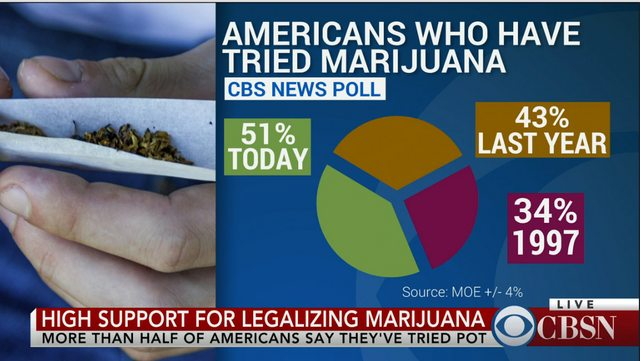
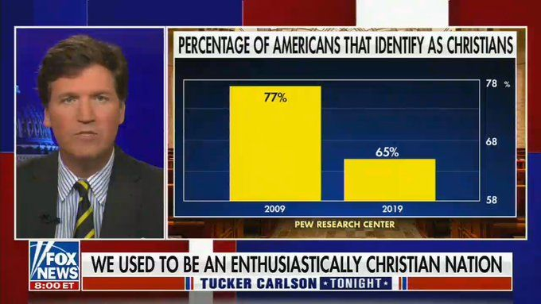

Cours DATA VIZ 11/09/2026

Le problème de cette visualisation est qu’elle donne une impression trompeuse des variations du prix du cuivre. L’échelle de l’axe vertical n’étant pas clairement visible, il est difficile de vérifier la proportionnalité des écarts représentés. De plus, certaines valeurs identiques, comme 868 $, sont représentées à des hauteurs différentes, ce qui donne visuellement l’impression d’une variation alors que la valeur reste identique.

Le titre est également inadapté. L’expression « se desploma » (« s’effondre ») suggère une forte baisse, alors que les données présentées montrent au contraire une hausse de 750 $ à 868 $, puis une stabilité à 868 $ sur les dernières observations. Le titre « Évolution du prix du cuivre » serait donc plus neutre et davantage cohérent avec les données présentées.

Pour rendre le graphique plus fidèle aux données, il faudrait utiliser une échelle verticale clairement indiquée et proportionnelle, positionner chaque point exactement en fonction de sa valeur et s’assurer que la courbe représente correctement les variations observées. Il faudrait également éviter un titre suggérant une tendance qui n’est pas démontrée par les données.

Le principal problème de cette visualisation est l’utilisation d’un diagramme circulaire pour représenter des données qui ne constituent pas les différentes parties d’un même total. Les valeurs 34 % (1997), 43 % (l’année dernière) et 51 % (aujourd’hui) correspondent au même indicateur mesuré à des moments différents : elles ne doivent donc pas être additionnées pour atteindre 100 %. Le graphique en secteurs donne ainsi l’impression qu’il s’agit de trois catégories qui composent un ensemble, ce qui est trompeur. Pour représenter correctement l’évolution de cet indicateur dans le temps, il faudrait utiliser un graphique en courbes ou en barres, avec les années/périodes sur l’axe horizontal et le pourcentage sur l’axe vertical.

Cette visualisation est trompeuse principalement parce que l’axe vertical ne commence pas à 0, mais à 58 %. Cela amplifie visuellement la différence entre 77 % et 65 %, donnant l’impression d’un écart beaucoup plus important que l’écart réel de 12 points de pourcentage. Cette représentation peut donc fausser la perception du lecteur et rendre l’interprétation de la différence entre les deux résultats moins précise. Pour améliorer la visualisation, il faudrait utiliser une échelle plus représentative, idéalement avec un axe commençant à 0. Comme il s’agit de résultats issus d’un sondage, il serait également pertinent d’indiquer la marge d’erreur et la taille de l’échantillon, si ces informations sont disponibles, afin de mieux évaluer la précision des résultats.

